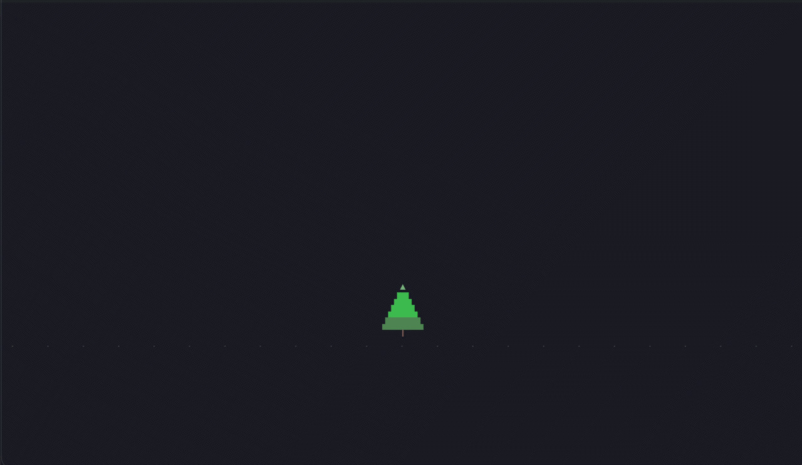

# pines

**pi + trees.** A tree-first TUI for [pi](https://pi.dev) coding agents.



Needs Node 22.19+ (up to 24). Ships with its own `pi` runtime.

```sh
npx @edeng23/pines
```

Or install the command: `npm i -g @edeng23/pines && pines`.

<details>
<summary>From source</summary>

```sh
pnpm install && pnpm build
npm link
pines        # or try it on a throwaway forest first: pnpm demo
```

`pnpm demo` keeps everything under `~/.pines-demo` — its own daemon, socket,
database and sessions. Your real `~/.pines` and `~/.pi` are never touched, and
no model is ever called.
</details>

Keybindings, looks, branching, architecture → **[docs/GUIDE.md](docs/GUIDE.md)**

<p align="center">
  
  <br>
</p>

Built on [pi](https://pi.dev) by Mario Zechner. Apache-2.0.
